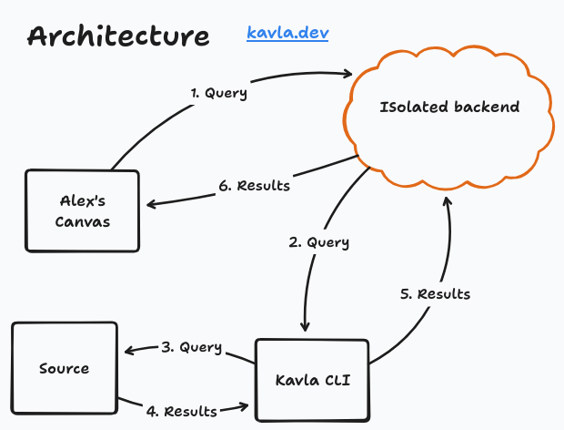

# Kavla CLI

Connect data sources to a [Kavla](https://kavla.dev) canvas.

Receive SQL from the browser, execute it locally, and relay previews back.

Your credentials never leave your machine.

## Architecture



- Every Kavla canvas has its own isolated backend
- A CLI session connects to one canvas over a dedicated websocket
- When it connects the CLI shares its configured sources to the canvas
- Only the CLI owner can execute queries against the CLI sources
- SQL can now be sent from the canvas to the CLI
- Credentials are never sent, they stay local
- When the CLI is terminated, the connection drops instantly
- Preview results are stored on the canvas after the CLI disconnects
- Results follow the canvas access rules and need to be explicitly shared

## Supported Sources

| Source    | Type        | Connection                                           |
| --------- | ----------- | ---------------------------------------------------- |
| DuckDB    | `duckdb`    | Path to an existing DuckDB file                      |
| Directory | `directory` | Path to a directory with CSV, Parquet, or JSON files |
| BigQuery  | `bigquery`  | Google Cloud project ID                              |

## Speed Run

### Install

```sh
curl -fsSL https://raw.githubusercontent.com/aleda145/kavla-cli/main/install.sh | bash
```

### Add a DuckDB database

```sh
kavla config add-source --name local --type duckdb --connection ./analytics.duckdb
```

### Login

```sh
kavla login
```

### Connect to a canvas

```sh
kavla connect
```

Or connect directly:

```sh
kavla connect <room_id>
```

## Config

Config lives in `~/.kavla/config.yaml`. Tokens and source definitions stay on your machine.

## Support

[kavla.dev](https://kavla.dev)

[Discord](https://discord.gg/aeBGuDdhtP)
